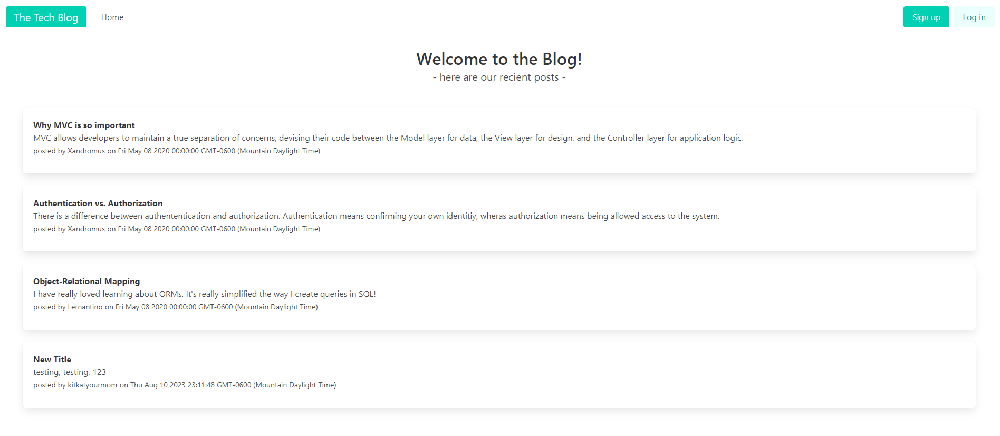
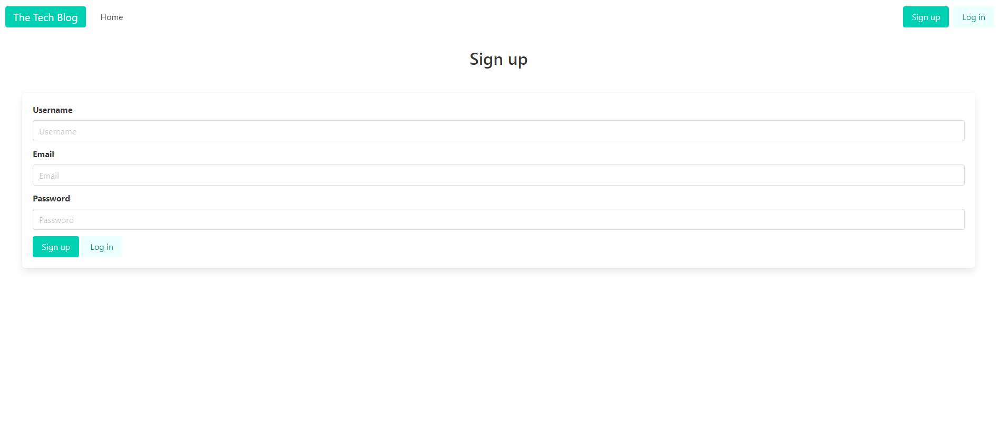
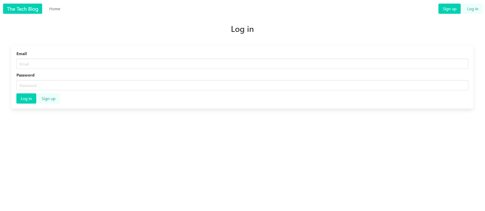

# Social Network API

## Description

In this project, I worked to create a CMS-style blog site. I was motivated to create a blog site that has posts with comments for a shared user experience.

This application was created so that a user could login and contribute to the conversation. If you are not interested in creating an account, the posts and comments are still available to be viewed. This CMS-style blog site follows the MVC paradigm, uses Handlebars.js as the templating language, Sequelize as the ORM, and uses the express-session npm package for authentication.

[Here is a link to the live application](https://murmuring-mountain-58427-843ecaf8140c.herokuapp.com/)!

---
---

## Table of Contents

- [Usage](#usage)
- [Credits](#credits)
- [License](#license)

---
---

## Usage

The usage of this application is similar to any other blog site. 

### Homepage
On the homepage, there are multiple posts created by users and comments on those posts. If you’re logged out, you don’t have access to add a post or comments.

### Create an Account
In order to contribute to the conversation, an account needs to be created

### Login
If you’ve already created an account, use the login to return to the conversation.

### My Posts
Checkout your posts
(not yet added)

---

## Credits

Helpful Resources:
W3 School’s information about JavaScript: https://www.w3schools.com/js/default.asp
Stack Overflow’s answered questions about JavaScript: https://stackoverflow.com/
MDN’s information on JavaScript: https://developer.mozilla.org/en-US/
Google.com helping me find the above resources
The Bootcamp gitLab DU-VIRT-FSF-PT-04-2023-U-LOLC repository

The README template I used was provided by The Full-Stack Blog: https://coding-boot-camp.github.io/full-stack/github/professional-readme-guide

---

## License
MIT Licence
